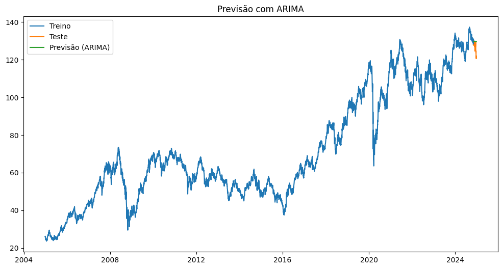
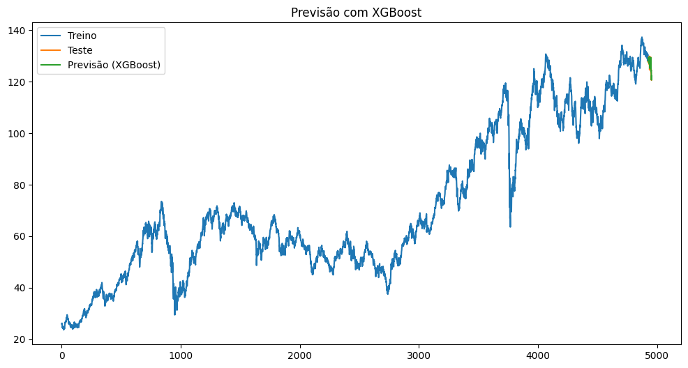
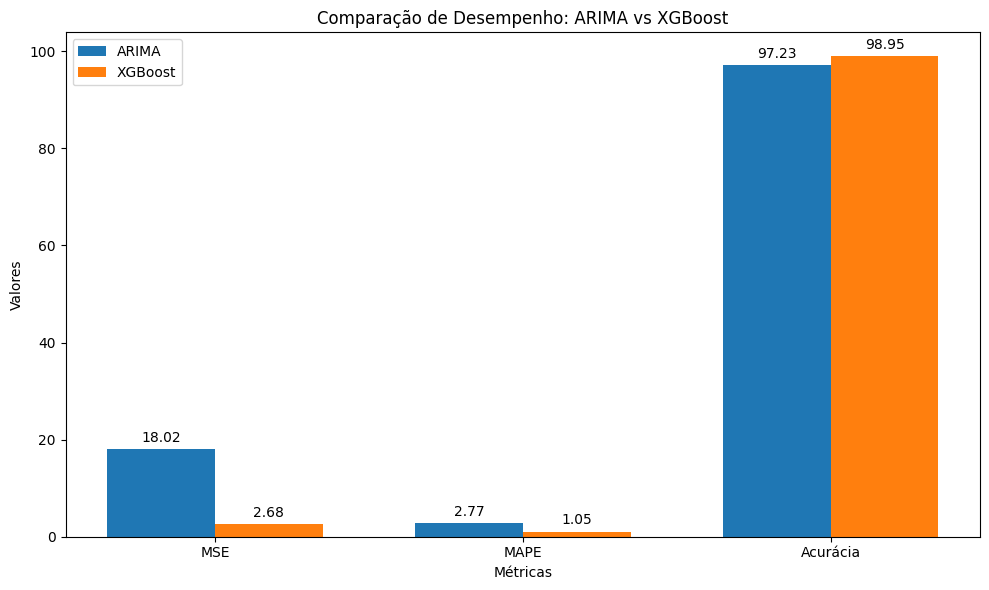

# Tech Challenge - Previsão de Fechamento do IBOVESPA

Este projeto foi desenvolvido como parte do Tech Challenge, englobando conhecimentos adquiridos em diversas disciplinas da fase. O objetivo principal é construir um modelo preditivo baseado em séries temporais para prever os valores de fechamento diário do índice IBOVESPA.

## **Problema Proposto**
O desafio consiste em:

1. **Modelar e prever o fechamento do índice IBOVESPA** utilizando dados históricos.
2. **Justificar a escolha da técnica de modelagem**.
3. **Atingir uma acurácia superior a 70%** para o modelo preditivo.

Os dados utilizados foram obtidos do site da Investing ([https://br.investing.com/indices/bovespa-historical-data](https://br.investing.com/indices/bovespa-historical-data)), selecionando o intervalo de tempo no formato "diário". 

---

## **Etapas do Projeto**

### **1. Captura e Processamento dos Dados**

- Carregamento da base de dados (arquivo `dados.csv`).
- Conversão da coluna `Data` para o formato datetime e ordenação crescente.
- Conversão de colunas numéricas (como `Último`, `Abertura`, `Máxima`, `Mínima`) para tipo float.
- Tratamento do volume (`Vol.`) e variações diárias (`Var%`).

### **2. Análise Exploratória de Dados (EDA)**

Foram realizadas as seguintes visualizações para melhor compreensão dos dados:

1. **Tendência do fechamento ao longo do tempo:**
   - Gráfico de linhas mostrando a evolução dos valores de fechamento (`Último`).

2. **Distribuição das variações diárias:**
   - Histograma da variação percentual (`Var%`) para entender a distribuição dos retornos diários.

3. **Volume negociado ao longo do tempo:**
   - Gráfico de linhas destacando o comportamento do volume negociado ao longo do tempo.

4. **Correlação entre variáveis numéricas:**
   - Matriz de correlação exibindo as relações entre as variáveis principais.

### **3. Construção e Avaliação dos Modelos Preditivos**

#### **Modelo ARIMA**
O modelo ARIMA (AutoRegressive Integrated Moving Average) foi utilizado para previsão de séries temporais.

- **Parâmetros:** (5, 1, 0).
- **Métricas de Avaliação:**
  - MSE: 18.02
  - MAPE: 2.68%
  - Acurácia: 97.23%

##### **Gráfico do Desempenho ARIMA**



#### **Modelo XGBoost**
O modelo XGBoost foi utilizado como uma alternativa baseada em aprendizado de máquina.

- **Parâmetros:**
  - 100 estimadores, learning rate de 0.1, profundidade máxima de 5.
- **Métricas de Avaliação:**
  - MSE: 2.68
  - MAPE: 1.05%
  - Acurácia: 98.95%

##### **Gráfico do Desempenho XGBoost**



### **Comparação entre os Modelos**

Os modelos foram comparados com base em três métricas principais: MSE, MAPE e Acurácia.

- O modelo XGBoost apresentou melhor desempenho em todas as métricas comparado ao ARIMA.

#### **Gráfico Comparativo**



---

## **Requisitos para Execução**

As bibliotecas necessárias para reproduzir este projeto estão listadas no arquivo `requirements.txt`. Certifique-se de instalá-las antes de executar o código:

```bash
pip install -r requirements.txt
```

## **Como Executar o Projeto**

1. Clone este repositório:
   ```bash
   git clone https://github.com/athospugliese/postech-fiap-challenge-fase2
   ```

2. Navegue até o diretório do projeto:
   ```bash
   cd postech-fiap-challenge-fase2
   ```

3. Instale as dependências:
   ```bash
   pip install -r requirements.txt
   ```

4. Execute o arquivo Jupyter Notebook:
   ```bash
   jupyter notebook
   ```

5. Abra o arquivo do notebook e execute as células sequencialmente.

---

## **Conclusão**
Este projeto demonstra o processo de captura, análise e previsão de séries temporais no contexto do índice IBOVESPA, oferecendo insights e uma abordagem preditiva que pode ser utilizada por equipes de investimentos. O modelo XGBoost demonstrou ser superior ao ARIMA, atingindo uma acurácia de quase 99%.

